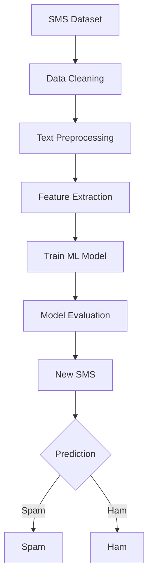

# 📩 SMS Spam Detection using NLP & Machine Learning

<p align="center">
  
  
  
  
</p>

<p align="center">
  <b>🚨 Detect Spam. 📩 Protect Messages. 🤖 Automate Classification.</b>
</p>

---

## 🧠 About The Project

**SMS Spam Detection** is a Natural Language Processing and Machine Learning project designed to automatically classify SMS messages into two categories:

* 🚨 **Spam** — Unwanted, promotional, fraudulent, or suspicious messages
* ✅ **Ham** — Genuine and legitimate messages

The project demonstrates how **NLP techniques + Machine Learning** can be used to solve a real-world **text classification problem**.

---

## 🎯 Project Objective

The primary goal of this project is to build a machine learning model that can understand the patterns present in SMS messages and accurately predict whether a new message is **Spam** or **Ham**.

> 💡 The model learns from previously labeled SMS messages and uses those patterns to classify unseen messages.

---
## 🔄 Machine Learning Workflow


---

## 🛠️ Technologies & Libraries

| Technology              | Purpose                       |
| ----------------------- | ----------------------------- |
| 🐍 **Python**           | Programming Language          |
| 🐼 **Pandas**           | Data Manipulation             |
| 🔢 **NumPy**            | Numerical Computation         |
| 🧠 **NLTK**             | Natural Language Processing   |
| 🤖 **Scikit-learn**     | Machine Learning              |
| 📊 **Matplotlib**       | Data Visualization            |
| 🎨 **Seaborn**          | Statistical Visualization     |
| 📓 **Jupyter Notebook** | Development & Experimentation |

---

## 🔍 NLP Techniques

The project uses several text-processing techniques to convert raw SMS messages into meaningful features for the ML model.

### 🧹 Text Preprocessing

* Convert text to lowercase
* Remove unnecessary characters
* Remove punctuation
* Tokenization
* Stopword removal
* Text normalization

### 🔤 Feature Extraction

Text data is transformed into numerical features so that machine learning algorithms can process it.

```text
Raw SMS
   ↓
Text Cleaning
   ↓
Tokenization
   ↓
Feature Extraction
   ↓
Numerical Representation
   ↓
Machine Learning Model
```

---

## 🤖 Model

The processed SMS data is used to train a **Machine Learning classification model** that predicts:

```text
Input SMS
    ↓
NLP Preprocessing
    ↓
Feature Extraction
    ↓
Trained ML Model
    ↓
┌───────────────┐
│ Spam or Ham ? │
└───────────────┘
```

---

## 🧪 Example Predictions

### 🚨 Spam Message

```text
"Congratulations! You have won ₹50,000 in a lucky draw.
Claim your prize now!"
```

### 🤖 Prediction

```text
🚨 SPAM
```

---

### ✅ Ham Message

```text
"Hey, are we still meeting at 7 pm today?
Let me know when you reach."
```

### 🤖 Prediction

```text
✅ HAM
```

---

## 📊 Model Evaluation

The model can be evaluated using standard classification metrics such as:

* Accuracy
* Precision
* Recall
* F1-Score
* Confusion Matrix

These metrics help determine how effectively the model distinguishes between **Spam** and **Ham** messages.

> 📌 Model performance can vary depending on the dataset, preprocessing techniques, feature extraction method, and classification algorithm.

---

## 📂 Project Structure

```text
SMS-Spam-Detection/
│
├── 📓 SMS_spam_detection.ipynb
│
├── 📊 spam .xlsx
│
└── 📄 README.md
```

---

## 🚀 Getting Started

### 1️⃣ Clone the Repository

```bash
git clone https://github.com/girish-indurkar/SMS-Spam-Detection.git
```

### 2️⃣ Navigate to the Project

```bash
cd SMS-Spam-Detection
```

### 3️⃣ Install Required Libraries

```bash
pip install pandas numpy nltk scikit-learn matplotlib seaborn jupyter
```

### 4️⃣ Launch Jupyter Notebook

```bash
jupyter notebook
```

Open:

```text
SMS_spam_detection.ipynb
```

and run the cells step by step.

---

## 🧪 Testing Your Own Message

You can test the trained model with a new SMS message:

```python
message = ["Congratulations! You have won a lottery prize!"]
```

The model will process the text and return a prediction:

```text
🚨 Spam
```

or

```text
✅ Ham
```

---

## 🌟 Key Highlights

✨ Real-world NLP application
✨ SMS text classification
✨ Machine Learning-based prediction
✨ Text preprocessing pipeline
✨ Spam vs Ham classification
✨ Easy to understand Jupyter Notebook implementation

---

## 🔮 Future Improvements

This project can be further improved by:

* 🌐 Deploying the model as a web application
* ⚡ Adding real-time SMS prediction
* 📱 Building a mobile-friendly interface
* 🔬 Comparing multiple ML algorithms
* 🧠 Using advanced NLP techniques
* 🤗 Experimenting with Transformer-based models
* 📊 Adding interactive visualizations
* ☁️ Deploying the application online

---

## 📚 Learning Outcomes

Through this project, I explored:

* Natural Language Processing
* Text preprocessing
* Feature engineering
* Machine Learning classification
* Model evaluation
* Real-world text classification
* End-to-end ML workflow

---

